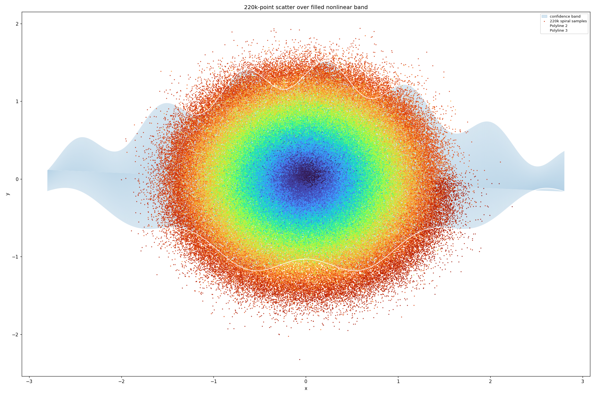
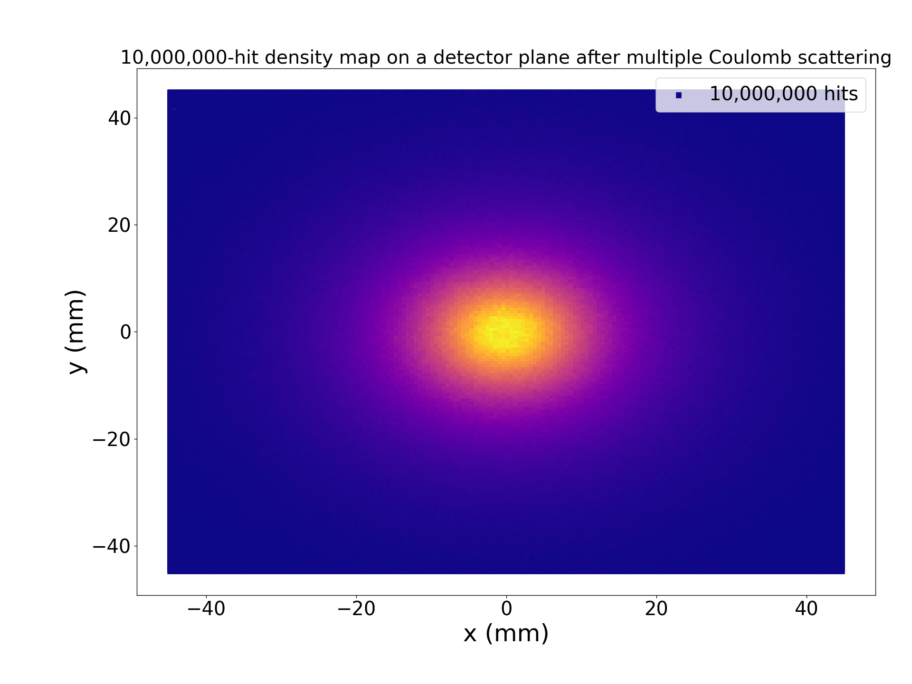
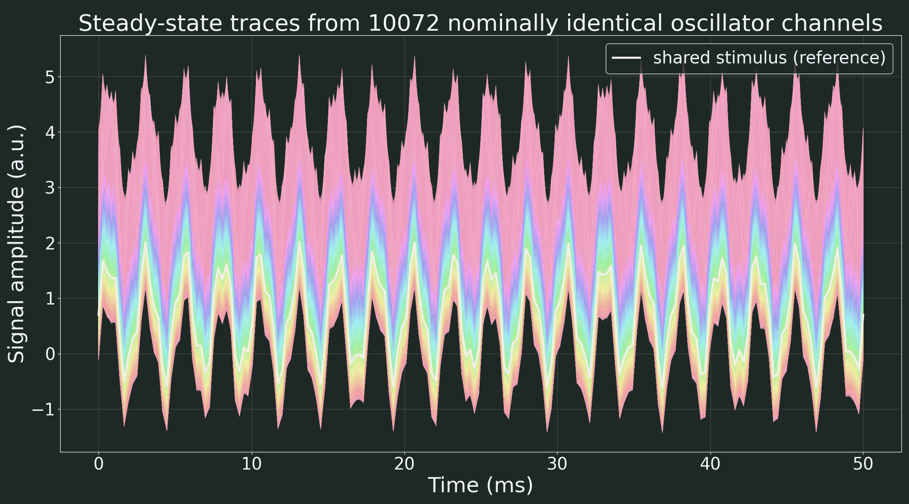
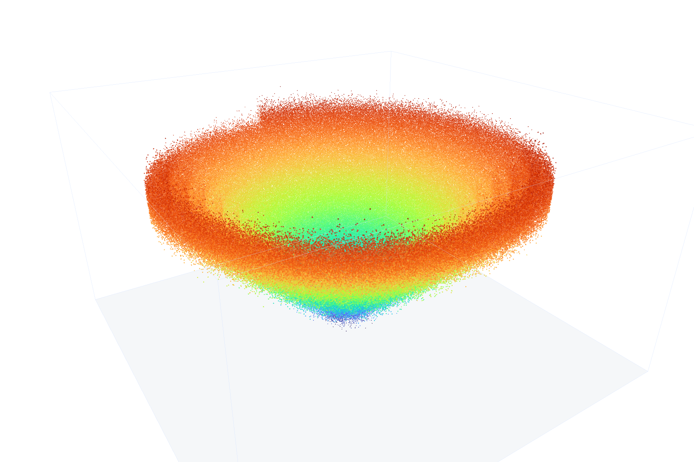
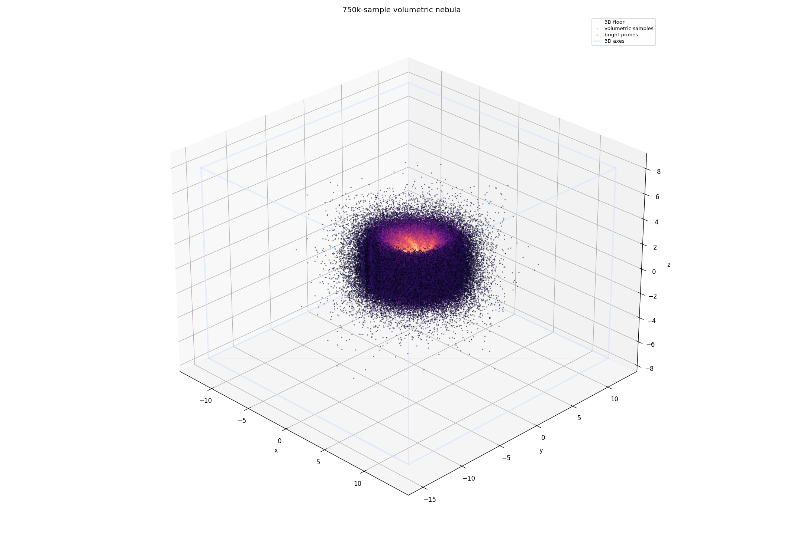
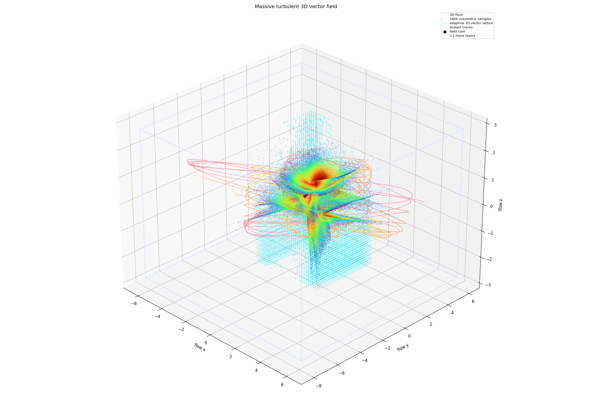
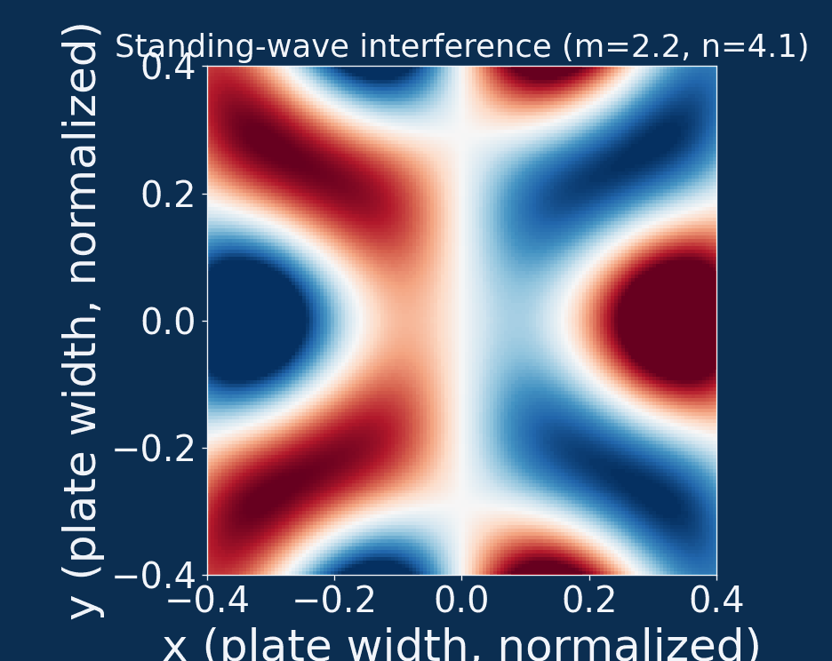
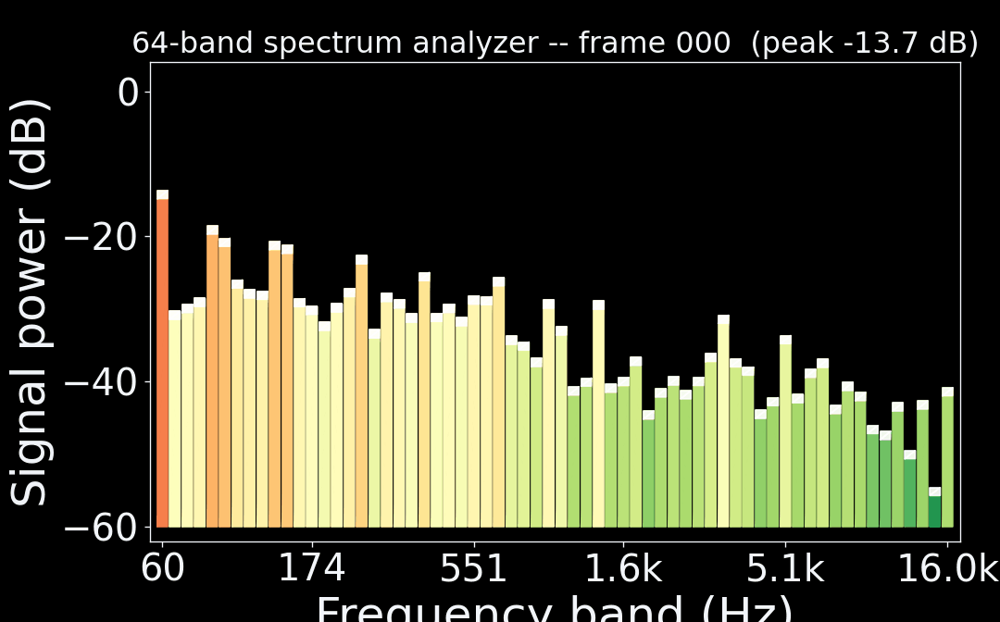
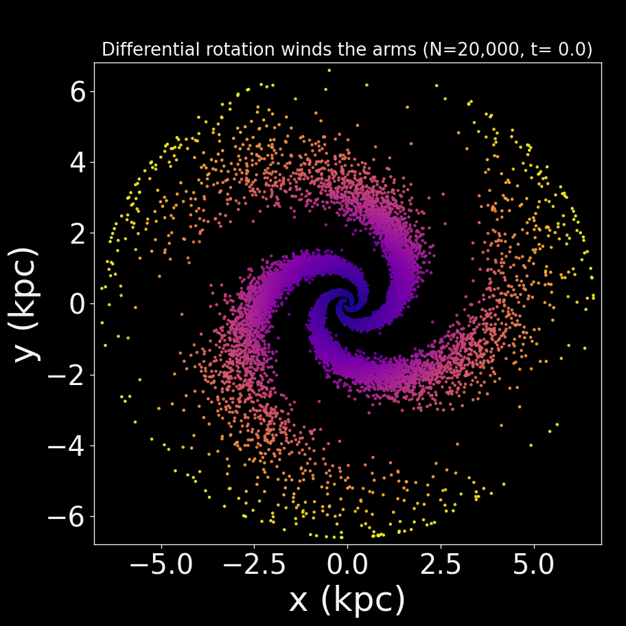

# GLPlot: GPU-Accelerated Plotting for Python

[](https://github.com/AkarisDimitry/GLPlot/actions/workflows/tests.yml)
[](https://github.com/AkarisDimitry/GLPlot/actions/workflows/lint.yml)
[](https://github.com/AkarisDimitry/GLPlot/actions/workflows/build.yml)
[](LICENSE)
[](pyproject.toml)

GLPlot is a Python plotting library with a Matplotlib-like API that renders on the GPU
through OpenGL instead of the CPU. Plots that make Matplotlib chug — millions of points,
dense line families, large 3D scenes — stay interactive: smooth pan, zoom, and rotation,
even at that scale. If you already know `plt.plot()` / `plt.scatter()`, most of what you
know carries over directly.

## Install

```bash
pip install glplot
```

or from source:

```bash
git clone https://github.com/AkarisDimitry/GLPlot.git
cd GLPlot
pip install -e .
```

Requires Python 3.11+. Core dependencies: numpy, scipy, matplotlib, glfw, PyOpenGL,
`imgui-bundle` (for the on-screen control panel).

## 30-second example

```python
import numpy as np
import glplot.pyplot as plt

x = np.linspace(0, 10, 100)

plt.figure("My Plot", figsize=(8, 5))
plt.plot(x, np.sin(x), "r-", lw=2, label="sin(x)")
plt.scatter(x[::10], np.sin(x[::10]), c="blue", s=20)
plt.xlabel("x")
plt.ylabel("y")
plt.legend()
plt.show()
```

That's it — a real window opens, fully interactive (pan/zoom/rotate) from the first frame.

## Interactive Examples Gallery (Click any figure to view code)

Explore 2D plots, 3D scenes, and real-time animations. **Click on any figure or title below to expand its full Python code, or click the file link to view the script.**

### 📊 2D Visualizations

<details>
<summary>

<br><b>🔍 Click to view code: 10-Million Point Spiral Scatter (<a href="examples/gallery/02_scatter_fill.py"><code>02_scatter_fill.py</code></a>)</b>
</summary>

📄 **Full script:** [`examples/gallery/02_scatter_fill.py`](examples/gallery/02_scatter_fill.py)

```python
import numpy as np
import glplot.pyplot as plt

rng = np.random.default_rng(4)
n = 10_000_000
theta = rng.uniform(0, 18 * np.pi, n)
radius = 0.025 * theta + rng.gamma(1.5, 0.006, n)
x_pc = radius * np.cos(theta) + rng.normal(scale=0.012, size=n)
y_pc = radius * np.sin(theta) + rng.normal(scale=0.012, size=n)
formation_phase = theta + 6.0 * radius  # proxy for age along the spiral arm

plt.figure("Simulated Spiral Star Field", figsize=(9, 6))
plt.scatter(x_pc, y_pc, c=formation_phase, cmap="turbo", s=1.5, alpha=0.72)
plt.title(f"Simulated stellar density along a spiral arm (N = {n:,} stars)")
plt.xlabel("x (pc)")
plt.ylabel("y (pc)")
plt.show()
```
</details>

<details>
<summary>

<br><b>🔍 Click to view code: 10M-Sample 2D Density Histogram (<a href="examples/gallery/10_massive_hist2d_density.py"><code>10_massive_hist2d_density.py</code></a>)</b>
</summary>

📄 **Full script:** [`examples/gallery/10_massive_hist2d_density.py`](examples/gallery/10_massive_hist2d_density.py)

```python
import numpy as np
import glplot.pyplot as plt

rng = np.random.default_rng(123)
n = 10_000_000
theta = rng.uniform(0, 2 * np.pi, n)
r = rng.gamma(shape=2.2, scale=0.8, size=n)
mm_per_unit = 10.0
x = mm_per_unit * (r * np.cos(theta) + rng.normal(scale=0.08, size=n))
y = mm_per_unit * (r * np.sin(theta) + rng.normal(scale=0.08, size=n))

plt.figure("Detector Impact Density", figsize=(8, 6))
lim = 45.0
plt.hist2d(
    x, y,
    bins=170,
    range=[[-lim, lim], [-lim, lim]],
    cmap="plasma",
    s=40.0,
    label=f"{n:,} hits",
)
plt.title(f"{n:,}-hit density map on detector plane")
plt.xlabel("x (mm)")
plt.ylabel("y (mm)")
plt.legend()
plt.show()
```
</details>

<details>
<summary>

<br><b>🔍 Click to view code: 10,072-Line Oscilloscope Ensemble (<a href="examples/gallery/01_line_plot.py"><code>01_line_plot.py</code></a>)</b>
</summary>

📄 **Full script:** [`examples/gallery/01_line_plot.py`](examples/gallery/01_line_plot.py)

```python
import colorsys
import numpy as np
import glplot.pyplot as plt

def chalk_color(hue: float, rng: np.random.Generator) -> tuple:
    sat = rng.uniform(0.22, 0.42)
    val = rng.uniform(0.90, 1.0)
    return colorsys.hsv_to_rgb(hue % 1.0, sat, val)

rng = np.random.default_rng(101)
n_channels = 10_072
n_points = 180
t = np.linspace(0, 40 * np.pi, n_points)
t_ms = t * (50.0 / (40 * np.pi))
stimulus = np.sin(t) + 0.35 * np.sin(2.7 * t)

plt.figure("Oscilloscope Ensemble", figsize=(9, 5))
plt.plot_style("chalk", layers=False)

frac = np.linspace(0.0, 1.0, n_channels)
hues = (rng.uniform(0, 1) + frac + rng.uniform(-0.02, 0.02, n_channels)) % 1.0

for i in range(n_channels):
    t_frac = frac[i]
    phase = rng.uniform(0, 2 * np.pi)
    amp = 0.12 + 0.781 * t_frac
    freq = 1.1 + 0.852 * t_frac
    offset = 3.195 * t_frac
    channel = stimulus + amp * np.sin(freq * t + phase)
    color = chalk_color(hues[i], rng)
    plt.plot(t_ms, channel + offset, color=(*color, 0.35), lw=0.5)

plt.plot(t_ms, stimulus + 0.7, color=(0.95, 0.94, 0.90, 1.0), lw=3.0, label="Reference")
plt.xlabel("Time (ms)")
plt.ylabel("Amplitude")
plt.title(f"Traces from {n_channels} oscillator channels")
plt.legend()
plt.show()
```
</details>

### 🪐 3D Visualizations

<details>
<summary>

<br><b>🔍 Click to view code: 1M-Point Circumstellar Dust Halo (<a href="examples/gallery/07_projected_3d_cloud.py"><code>07_projected_3d_cloud.py</code></a>)</b>
</summary>

📄 **Full script:** [`examples/gallery/07_projected_3d_cloud.py`](examples/gallery/07_projected_3d_cloud.py)

```python
import numpy as np
import glplot.pyplot as plt

rng = np.random.default_rng(77)
n = 1_000_000
sigma = 42.0
outer_radius = 2.5 * sigma
n_gen = 1_140_000
x = rng.normal(0.0, sigma, n_gen)
y = rng.normal(0.0, sigma, n_gen)
z = rng.normal(0.0, sigma, n_gen)
inside = (x**2 + y**2 + z**2) < outer_radius**2
x, y, z = x[inside][:n], y[inside][:n], z[inside][:n]

plt.figure("Circumstellar Dust Halo", figsize=(9, 6))
plt.scatter3d(
    x, y, z,
    c=z,
    cmap="viridis",
    s=1.1,
    alpha=0.75,
    elev=22,
    azim=-42,
    label=f"{n:,} grains",
)
plt.title(f"Simulated circumstellar dust halo ({n:,} grains)")
plt.xlabel("x (AU)")
plt.ylabel("y (AU)")
plt.zlabel("z (AU)")
plt.legend()
plt.show()
```
</details>

<details>
<summary>

<br><b>🔍 Click to view code: 1.75M-Point Volumetric Nebula (<a href="examples/gallery/13_volumetric_nebula.py"><code>13_volumetric_nebula.py</code></a>)</b>
</summary>

📄 **Full script:** [`examples/gallery/13_volumetric_nebula.py`](examples/gallery/13_volumetric_nebula.py)

```python
import numpy as np
import glplot.pyplot as plt

rng = np.random.default_rng(1313)
n = 1_750_000
outer_radius = 3.2
n_gen = 2_000_000
theta = rng.uniform(0, 8 * np.pi, n_gen)
phi = rng.normal(0.0, 0.48, n_gen)
r = rng.gamma(2.0, 0.8, n_gen)
inside = r < outer_radius
theta, phi, r = theta[inside][:n], phi[inside][:n], r[inside][:n]
arm = rng.integers(0, 4, n) * np.pi / 2
twist = theta + arm + 0.62 * r
x = r * np.cos(twist) + rng.normal(scale=0.06, size=n)
y = r * np.sin(twist) + rng.normal(scale=0.06, size=n)
z = 0.65 * r * np.sin(phi) + 0.18 * np.sin(theta)
emission = np.exp(-0.12 * r**2) + 0.28 * np.sin(3 * theta) ** 2

plt.figure("Volumetric 3D Nebula", figsize=(9, 6))
plt.volume3d(
    x, y, z, emission,
    threshold=0.14,
    cmap="magma",
    alpha=0.42,
    s=1.2,
    elev=24,
    azim=-52,
    label=f"{n:,} points",
)
plt.title(f"{n:,}-point volumetric emission nebula")
plt.xlabel("x (ly)")
plt.ylabel("y (ly)")
plt.zlabel("z (ly)")
plt.legend()
plt.show()
```
</details>

<details>
<summary>

<br><b>🔍 Click to view code: 3D Turbulent Vector Field (<a href="examples/gallery/19_turbulent_vector_field_3d.py"><code>19_turbulent_vector_field_3d.py</code></a>)</b>
</summary>

📄 **Full script:** [`examples/gallery/19_turbulent_vector_field_3d.py`](examples/gallery/19_turbulent_vector_field_3d.py)

```python
import numpy as np
import glplot.pyplot as plt

rng = np.random.default_rng(1919)
cloud_n = 950_000
t = rng.uniform(0.0, 18.0 * np.pi, cloud_n)
shell_raw = rng.gamma(2.2, 0.42, cloud_n)
shell = 2.0 * np.tanh(shell_raw / 2.0)
twist = 0.22 * np.sin(2.6 * t) + 0.18 * np.cos(1.4 * t)
cloud_x = shell * np.sin(t) + 0.28 * np.sin(3.0 * t)
cloud_y = shell * np.cos(1.17 * t) + 0.32 * np.cos(2.4 * t)
cloud_z = 0.58 * np.sin(0.52 * t + twist) + 0.32 * shell * np.cos(0.33 * t)
cloud_energy = np.exp(-0.22 * shell**2) + 0.33 * np.sin(1.7 * t) ** 2

plt.figure("Turbulent 3D Flow", figsize=(10, 7), ssao=True)
plt.volume3d(
    cloud_x, cloud_y, cloud_z, cloud_energy,
    threshold=0.22,
    cmap="inferno",
    alpha=0.17,
    s=0.72,
    elev=27,
    azim=-49,
    label=f"{cloud_n:,} volumetric samples",
)
plt.title("Massive 3D turbulent swirl")
plt.xlabel("x")
plt.ylabel("y")
plt.zlabel("z")
plt.legend()
plt.show()
```
</details>

### 🎬 Animated Visualizations

<details>
<summary>

<br><b>🔍 Click to view code: Animated Standing-Wave Interference (<a href="examples/gallery/28_chladni_wave_animation.py"><code>28_chladni_wave_animation.py</code></a>)</b>
</summary>

📄 **Full script:** [`examples/gallery/28_chladni_wave_animation.py`](examples/gallery/28_chladni_wave_animation.py)

```python
import numpy as np
import glplot.animation as animation
import glplot.pyplot as plt

N = 360
x = np.linspace(-1.0, 1.0, N)
y = np.linspace(-1.0, 1.0, N)
X, Y = np.meshgrid(x, y)
FRAMES = 54

def chladni_field(m: float, n: float) -> np.ndarray:
    return np.sin(m * np.pi * X) * np.cos(n * np.pi * Y) - np.sin(n * np.pi * X) * np.cos(m * np.pi * Y)

def mode_pair(frame: int) -> tuple:
    t = frame / FRAMES
    m = 2.2 + 4.3 * (0.5 - 0.5 * np.cos(2 * np.pi * t))
    n = 3.1 + 3.6 * (0.5 - 0.5 * np.cos(2 * np.pi * t * 1.5 + 1.1))
    return m, n

def zoom_span(frame: int) -> float:
    t = frame / FRAMES
    return 0.75 - 0.35 * np.cos(2 * np.pi * t)

fig = plt.figure("Animated Standing-Wave Interference", figsize=(7.8, 6.2))
plt.plot_style("blueprint")

def update(frame: int):
    m, n = mode_pair(frame)
    span = zoom_span(frame)
    Z = chladni_field(m, n)
    plt.cla()
    plt.imshow(Z, extent=(-1, 1, -1, 1), origin="lower", cmap="RdBu_r", vmin=-1.0, vmax=1.0, aspect="equal")
    plt.xlim(-span, span)
    plt.ylim(-span, span)
    plt.title(f"Standing-wave interference (m={m:.1f}, n={n:.1f})")
    plt.xlabel("x (plate width)")
    plt.ylabel("y (plate width)")
    return []

ani = animation.FuncAnimation(fig, update, frames=FRAMES, interval=42)
ani.save("chladni_wave_animation.gif", fps=20)
plt.show()
```
</details>

<details>
<summary>

<br><b>🔍 Click to view code: Real-Time Audio Spectrum Analyzer (<a href="examples/gallery/animations/03_spectrum_analyzer_bars.py"><code>03_spectrum_analyzer_bars.py</code></a>)</b>
</summary>

📄 **Full script:** [`examples/gallery/animations/03_spectrum_analyzer_bars.py`](examples/gallery/animations/03_spectrum_analyzer_bars.py)

```python
import numpy as np
import glplot.animation as animation
import glplot.pyplot as plt

N_BANDS = 64
FRAMES = 84
band_x = np.arange(N_BANDS)

fig = plt.figure("Audio Spectrum Analyzer", figsize=(9, 5))

def update(frame: int):
    t = frame / FRAMES
    levels = -25.0 + 18.0 * np.sin(np.linspace(0.2, 4.0 * np.pi, N_BANDS) + 2.0 * np.pi * t)
    plt.cla()
    plt.bar(band_x, levels, color="tab:cyan", alpha=0.85)
    plt.ylim(-60, 0)
    plt.title("Real-Time 64-Band Spectrum Analyzer")
    plt.xlabel("Frequency Band")
    plt.ylabel("Power (dBFS)")
    return []

ani = animation.FuncAnimation(fig, update, frames=FRAMES, interval=33)
ani.save("spectrum_analyzer.gif", fps=30)
plt.show()
```
</details>

<details>
<summary>

<br><b>🔍 Click to view code: Differential Keplerian Star Cluster (<a href="examples/gallery/animations/01_orbiting_star_cluster.py"><code>01_orbiting_star_cluster.py</code></a>)</b>
</summary>

📄 **Full script:** [`examples/gallery/animations/01_orbiting_star_cluster.py`](examples/gallery/animations/01_orbiting_star_cluster.py)

```python
import numpy as np
import glplot.animation as animation
import glplot.pyplot as plt

N_STARS = 20_000
FRAMES = 80
LIM = 6.8

rng = np.random.default_rng(42)
radius = rng.exponential(scale=1.35, size=N_STARS) + 0.10
arm_id = rng.integers(0, 3, N_STARS)
theta0 = arm_id * (2.0 * np.pi / 3) + 1.65 * np.log(radius / 0.10)
omega = 1.35 / np.sqrt(radius + 0.30)

fig = plt.figure("Orbiting Star Cluster", figsize=(8, 8))

def update(frame: int):
    t = frame * 0.08
    theta = theta0 + omega * t
    x = radius * np.cos(theta)
    y = radius * np.sin(theta)
    plt.cla()
    plt.scatter(x, y, c=radius, cmap="plasma", s=1.2, alpha=0.8)
    plt.xlim(-LIM, LIM)
    plt.ylim(-LIM, LIM)
    plt.title(f"Differential Keplerian rotation ({N_STARS:,} stars)")
    return []

ani = animation.FuncAnimation(fig, update, frames=FRAMES, interval=40)
ani.save("star_cluster.gif", fps=25)
plt.show()
```
</details>

**All of the above render at 60+ FPS** with interactive panning, zooming, and rotation, regardless of point count. Discover more in the [example gallery](examples/gallery/README.md) (28 static scripts) and the [animated gallery](examples/gallery/animations/README.md) (15 animated scripts).

## Features

- **Matplotlib-compatible API** — `plot`, `scatter`, `bar`, `hist`, `hist2d`, `imshow`,
  `contour`/`contourf`, `quiver`, format strings (`"r-o"`, `"b--"`), and more
- **Millions of points, still interactive** — GPU instancing and density accumulation
  instead of CPU-side geometry construction
- **Full 2D/3D** — lines, scatter, filled regions, bars, histograms, matrices, surfaces,
  wireframes, 3D bars, vector fields, with SSAO depth shading in 3D
- **Real multi-panel subplots** — `plt.subplots()`, per-panel interaction
- **Animation** — `glplot.animation.FuncAnimation`/`ArtistAnimation`, exportable to GIF/video
- **A live control panel** — `python -m glplot` opens a workstation for editing a scene,
  its layers, and its styling interactively, with undo history
- **Numerically stable at extreme zoom** — double-precision, viewport-relative coordinate
  transforms avoid the jitter that single-precision GPU pipelines show at large offsets

## Quick Reference Recipes

**A million lines at once (`plot_lines`)**

Ordinary plotting draws each line as CPU-generated geometry — a million calls to `plot()`
would build a million separate meshes. `plot_lines` instead uploads each line as an
`(a, b)` coefficient pair and lets the GPU work out what's visible:

```python
import numpy as np
import glplot.pyplot as plt

n = 1_000_000
a = np.random.randn(n)
b = np.random.randn(n)

plt.figure("Density")
plt.plot_lines(a, b, x_range=(-2, 2))
plt.show(density=True)
```

## How it compares

| Feature | GLPlot | Matplotlib | Plotly | Datashader | VisPy |
|---|---|---|---|---|---|
| GPU acceleration | ✓ (OpenGL) | ✗ | ✗ | ✓ | ✓ |
| Matplotlib-style API | ✓ | ✓ | ✗ | ✗ | ✗ |
| Millions of points, interactive | ✓ | ✗ | Limited | ✓ | ✓ |
| Interactive 3D | ✓ | Limited | ✓ | Limited | ✓ |
| Density visualization | ✓ (HDR) | Basic | Limited | ✓ | ✗ |
| Precision at extreme zoom | ✓ (double precision) | ✓ | Basic | ✓ | ✗ |

GLPlot sits between "familiar API, CPU-bound" (Matplotlib) and "GPU-fast, low-level"
(VisPy): a Matplotlib-shaped surface backed by a GPU renderer.

## Rendering architecture

GLPlot runs two rendering pipelines — one for 2D primitives (lines, scatter, density) and
one for 3D geometry (bars, surfaces, wireframes, `scatter3d`) — both driven from the CPU
but doing their actual work on the GPU. `glReadPixels` is only ever called for export; the
interactive path never reads pixels back to the CPU.


See [docs/ARCHITECTURE.md](docs/ARCHITECTURE.md)
for the full derivation of each stage, including the density-accumulation math and the
viewport-relative projection that keeps zoom numerically stable.

## Testing

```bash
pytest                                   # run everything
pytest --cov=glplot --cov-report=html    # with coverage
pytest tests/test_pyplot.py::test_plot_accepts_y_only_and_returns_artists  # one test
```

6,800+ tests, run fully headless (no window is ever displayed) so they work in CI. The
matrix covers Python 3.11–3.13 on Ubuntu, macOS, and Windows; `black`, `isort`, and `flake8`
are enforced on every push. See `examples/benchmark/` for reproducible performance
comparisons against Matplotlib, VisPy, fastplotlib, Datashader, and hvPlot, and `tools/`
for GPU/environment diagnostics.

## Documentation

- API reference: docstrings in `glplot.pyplot`, or the built docs — see [docs/README.md](docs/README.md)
- Architecture: [docs/ARCHITECTURE.md](docs/ARCHITECTURE.md)
- Dev tools: [tools/README.md](tools/README.md)
- Contributing: [CONTRIBUTING.md](CONTRIBUTING.md) · Code of conduct: [CODE_OF_CONDUCT.md](CODE_OF_CONDUCT.md)

## Citation

```bibtex
@software{lombardi2026glplot,
  title={GLPlot: High-Performance GPU-Accelerated Plotting Library for Python},
  author={Lombardi, Juan Manuel and Riccius, Felix and Holland, Julian and Ducci, Gianmarco},
  year={2026},
  url={https://github.com/AkarisDimitry/GLPlot},
  doi={10.5281/zenodo.PLACEHOLDER}
}
```

See [CITATION.cff](CITATION.cff) for other formats.

## License

[MIT](LICENSE).

## Acknowledgments

Built on PyOpenGL, GLFW, NumPy, SciPy, Matplotlib, and Dear ImGui — thanks to those
communities for the foundations this sits on.
